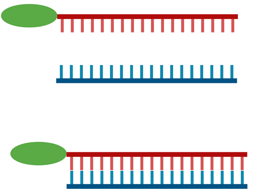
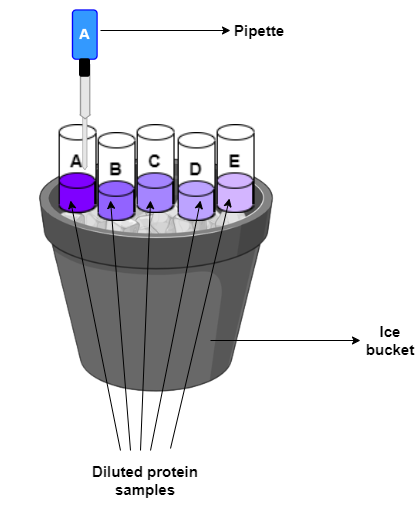
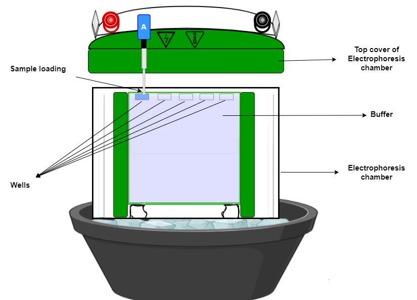
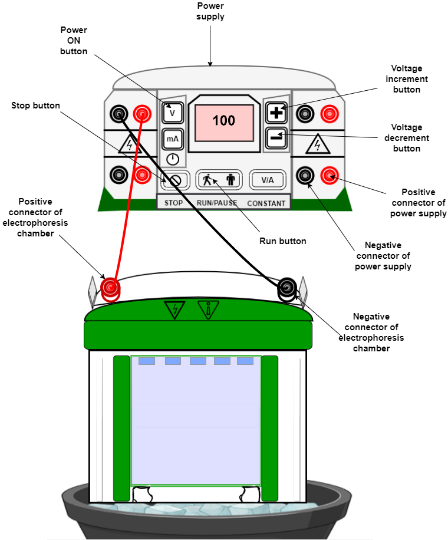
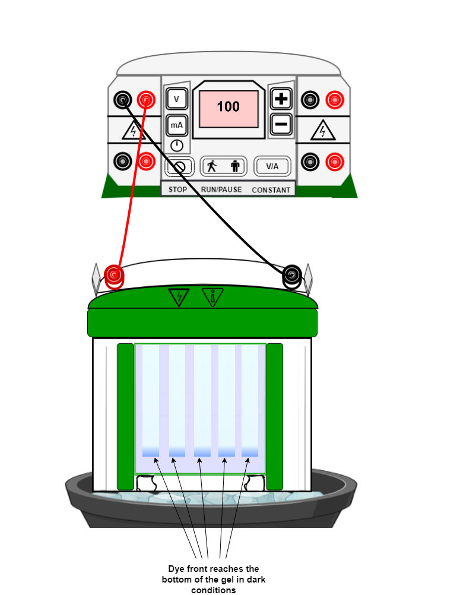
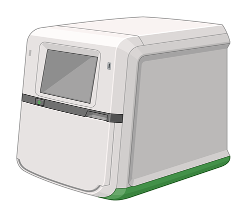
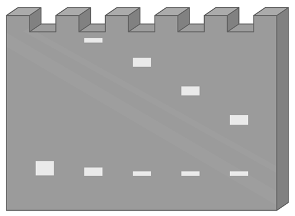

## Procedure

### Materials Required 
-	Fluorescently-labelled DNA probe
-	Protein sample
-	Binding buffer (e.g., 10 mM Tris (pH 7.8), 100 mM KCl, 6 mM MgCl2, 1 mM EDTA, 50% glycerol, 2 mM BME, 0.01 mg/ml BSA and 0.02% NP-40)
-	Polyacrylamide gel (6% or 8%)
-	Loading buffer (e.g., 10 mM Tris-HCl pH 7.8, 1 mM EDTA, 50% glycerol, 0.001% bromophenol blue)
-	Electrophoresis buffer (e.g., 0.5x Tris-borate-EDTA (TBE))

**To perform the experiment, following steps must be followed:** 
1.	Prepare the fluorescently-labelled DNA probe by annealing the complementary oligonucleotides in thermocycler. The probe should be purified by gel electrophoresis and quantified by UV spectroscopy.

2. Prepare the protein sample by diluting it in binding buffer to the desired concentration. 

3.	Mix the protein sample with the fluorescently-labelled DNA probe and incubate in ice for 20-30 minutes to allow the protein-DNA complex to form. 

4.	Prepare a polyacrylamide gel and pre-run it in electrophoresis buffer for 30-40 minutes.
5.	Mix the protein-DNA complex with loading buffer and load onto the gel.

6.	Run the gel in electrophoresis buffer at 100-120 volts until the dye front reaches the bottom of the gel in dark conditions as DNA is fluorescently labelled.

 

7.	Visualize the protein-DNA complex under the fluorescence sensitive imaging system.

<!--div align="center">

</div-->
